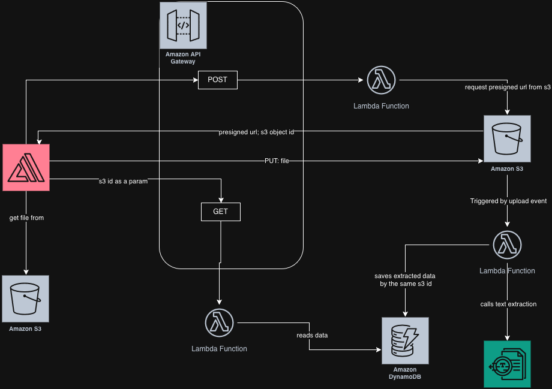

# Xpance

Xpance is a cloud native app that extracts and displays text from receipt picture.  
This repo holds the code necessary to deploy and connect the cloud infrastructure via a simple CLI.

## Architecture


The gateway serves 2 endpoints.  
POST is used to generate a presigned URL from an S3 bucket, such that the receipt can be uploaded directly.  
File upload to that bucket triggers a lambda function that extracts the text via Amazon Textract service, parses the data, then stores the parsed object in a DynamoDB table.  
GET method is the used to retrieve the receipt data from the DB.

## Installation & setup

Use the following command to install project dependencies.
I highly recommended running it in a [python virtual environment](https://docs.python.org/3/library/venv.html).

```bash
pip install -r requirements.txt
```

Create a .env file and place the AWS credentials in there.
```ini
aws_access_key_id=<YOUR-ACCESS-KEY-ID>
aws_secret_access_key=<YOUR-SECRET-ACCESS-KEY>
aws_session_token=<YOUR-SESSION-TOKEN>

ROLE_ARN=<YOUR-ROLE-ARN>
```

## Run

Each of the following modules can be run in order to configure every cloud service: [DynamoDB](dynamo_manager.py), [API Gateway](apigw_manager.py), [S3](s3_manager.py), and [Lambda](lambda_manager.py).

The following command opens a simple config menu:

```bash
python3 <manager_name>.py
```

To deploy the full infrastructure run

```bash
python3 infra.py
```
then choose `2 - Create all` option.  
See the status of the infrastructure via `1 - status`.  
Use `3 - Connect all` to enable the connection between S3 and Lambda. This step might take a few seconds.  
`4 - Trigger all` is used to test the pipeline
